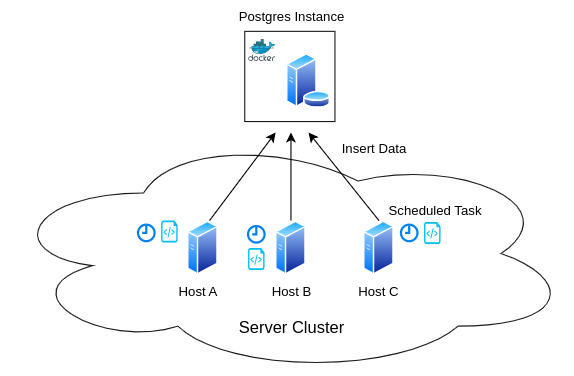

# Linux Cluster Monitoring Agent

## 📖 Introduction

The Linux Cluster Monitoring Agent is set of command line utilities
that together provide users with the ability to supervise resource usage across their hosts.
This functionality is particularly advantageous for managing server clusters
as it supports automatic process monitoring on many hosts simultaneously. Moreover, users
can reference the data to compare usage statistics to ensure storage and cpu loads are distributed evenly
across the cluster.

In particular, the data is stored in a Postgresql database that is accessed via
a Dockerized Postgres client. The PSQL table provisioning and database relations are
established by running a SQL script, while creating, starting, and stopping the Docker
instance is managed by a Bash script. The database is populated automatically through
a scheduled cronjob that runs a Bash script which extracts important metrics pertinent to
the server usage. Feature development and version management is orchestrated using Git.

## 🏃 Quick Start and Usage

### ⚙️ Prerequisites and Dependencies:

- ✅ Docker installed locally
- ✅ Postgresql installed locally
- ✅ Use a Bash shell

### 🐋 Create Docker Container

```
./scripts/psql_docker.sh create <psql_username> <psql_password>
```

### 🚦 Start or Stop Container

```
./scripts/psql_docker.sh [start|stop]
```

### 🐘 Create PSQL Database and Tables

Connect to Postgres via CLI (enter password on prompt)

```
psql -h <hostname> -U <psql_user> -W
```

Create database within Postgres client

```
CREATE DATABASE host_agent;
\q; -- Exit PSQL
```

Run SQL script from CLI to create tables

```
psql -h <hostname> -U <psql_user> -f ddl.sql
```

### 🖥️ Populate Tables

Run once, gets static hardware info related to host

```
./scripts/host_info.sh <hostname> <psql_port> <db_name> <psql_user> <psql_password>
```

### 🤖 Automate Data Collection

```
crontab -e
* * * * * bash /path/to/here/scripts/host_usage.sh <hostname> <psql_port> <db_name> <psql_user> <psql_password> > /tmp/host_usage.log
```

## 🪛 Implementation

### 📐 Architecture

The system design is illustrated in Figure 1, below. It shows several hosts, which belong to some cluster. Each of these hosts could be running various services and applications. To analyze the utilization of each host, a scheduled job is executed on each host periodically to document and log the current usage statistics and tabulate the results in a Postgres database shared amongst the hosts.

**Figure 1:** Linux Cluster Monitoring Architecture


### 📜 Scripts

There are several scripts in this repository which serve to automate different tasks and abstract work away from the end user.

Firstly, there is `psql_docker.sh`. This script concerns itself with the creation, starting, and stopping of the Postgres instance which is containerized in Docker. The usage is as follows:

```
/path/psql_docker.sh [create | start | stop] <db_username> <db_password>
```

where the database credentials are necessary for the create command but need not be included for start | stop. Naturally, start and stop are used to start and stop an existing container, while create is used to make a new container which will use the supplied administrator details.

Secondly, there is `ddl.sql`. This script serves to create the psql data tables within the host_agent database that was manually created. The usage has no CLI arguments and can be executed through the command /path/ddl.sql

Thirdly, there is `host_info.sh`. This script is used to collect information regarding the host's hardware such as the cpu frequency, the name, total memory, etc. It can be used as follows:

```
/path/host_info.sh <psql_host> <psql_port> <db_name> <psql_user> <psql_password>
```

This collects the information and tabulates it in a Postgres DB identified by host, port, and database name. The command is authorized by the user and password.

Next, there is the script `host_usage.sh`. The purpose of this shell is to obtain real time host usage statistics such as available memory, disk input/output, idle time, etc. The usage echoes that of host_info:

```
/path/host_usage.sh <psql_host> <psql_port> <db_name> <psql_user> <psql_password>
```

However, this command only provides a snap shot of the usage at the time the command was executed. In order to get periodic snaps, the job must be scheduled.

As hinted towards, the data collected by `host_usage.sh` can be scheduled to execute periodically using a tool known as cron. Execute the command: `crontab -e`, and add the line

```
* * * * * bash /path/host_usage.sh <psql_host> <psql_port> <db_name> <psql_user> <psql_password> > /tmp/host_usage.log
```

The result is that the usage script will execute once per minute and update the database accordingly while also logging the status of the script execution and any associated output.

The application solves several business concerns: host usage statistics which help ensure proper implementation of load-balancing techniques, automatic data collection, as well as automatic database configuration, storage, and runtime.

### 📈 Database Modelling

The data is stored in SQL tables that follow the structures shown below:

#### Host Info Table Schema

| Column Name      | Data Type | Constraints           |
| ---------------- | --------- | --------------------- |
| id               | SERIAL    | NOT NULL, PRIMARY KEY |
| hostname         | VARCHAR   | NOT NULL, UNIQUE      |
| cpu_number       | INT2      | NOT NULL              |
| cpu_architecture | VARCHAR   | NOT NULL              |
| cpu_model        | VARCHAR   | NOT NULL              |
| cpu_mhz          | FLOAT8    | NOT NULL              |
| l2_cache         | INT4      | NOT NULL              |
| timestamp        | TIMESTAMP | NULL                  |
| total_mem        | INT4      | NULL                  |

### Host Usage Table Schema

| Column Name    | Data Type | Constraints                                    |
| -------------- | --------- | ---------------------------------------------- |
| timestamp      | TIMESTAMP | NOT NULL                                       |
| host_id        | SERIAL    | NOT NULL, FOREIGN KEY REFERENCES host_info(id) |
| memory_free    | INT4      | NOT NULL                                       |
| cpu_idle       | INT2      | NOT NULL                                       |
| cpu_kernel     | INT2      | NOT NULL                                       |
| disk_io        | INT4      | NOT NULL                                       |
| disk_available | INT4      | NOT NULL                                       |

## 🧪 Test

Firstly, experimentation with the commands was conducted in order do design commands that performed as desired and extracted the correct information. Once these commands were deduced, they were combined into a script so that several commands could be executed at once and in succession. After the scripts were developed they were tested by validating the output in the PSQL database. That is, the populated values were cross-referenced against those outputted by the script to ensure correct tabulation. The result was that the scripts correctly extracted the desired information and properly tabulated the results against the database schema.

## 🚂 Deployment

The application runtime is in a docker container. Particularly, the Postgres instance is containerized and isolated from the host in this way. However, Docker containers do not natively provide persistent data storage and so it is necessary to mount a volume on the host to that of the Docker container, thus, enabling the database to persist beyond the application lifetime. The code was maintained using Git while following the principles of GitFlow, using feature branches to develop features in isolation. Ultimately, the code was uploaded to GitHub for public accessibility and distribution. It is deployed through a scheduled cron job. This script runs every minute on every host that is being tracked and will continue to do so until stopped. This feature is advantageous as it streamlines the data collection without requiring manual execution.

## 🏗️ Improvements

Some possible areas for improvement include:

- Implementing the database creation in the script that creates the info and usage tables so that this step does not have to be completed manually
- Automatically add the cron job to periodically run the host_usage script
- Collect network statistics
- Automate testing and add it to the pipeline
- Develop a web application for improved interfacing with the data
